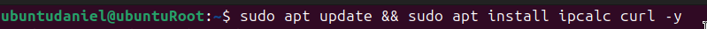

# Тестовое задание - Данило Ярина
Здраствуйте,
Предоставляю результаты тестового задания.
[Письмо бабушке во вложении](#письмо-бабушке)
# Практическое задания

1. Установите VirtualBox на свой компьютер. Создайте новую виртуальную машину с названием `%ubuntu-your_name%`.


2. Установите Ubuntu Desktop (amd64) на зашифрованный средствами ОС диск. Сделайте скриншот рабочего стола виртуальной машины.


3. Выполните команду `lsblk` в терминале и предоставьте её вывод.


4. Используя терминал, установите утилиты `curl` и `ipcalc`. В отчёте укажите команду, которую использовали для установки.




5. С помощью App Center установите Thunderbird.


6. Установите **Telegram Desktop** вручную, скачав архив с официального сайта [https://desktop.telegram.org](https://desktop.telegram.org). **Не** используйте Snap или Flatpak.


7. Установите Google Chrome и откройте страницу [https://www.servers.com/news/events/](https://www.servers.com/news/events/).


8. Настройте в Thunderbird свой почтовый аккаунт. Сделайте скриншот запущенных приложений.


9. Создайте текстовый файл с помощью редактора **vi** с текстом:

```
Hello, it's my first text document in Linux
```

Сделайте скриншот.


10. Выполните команду для созданного файла:

```zsh
chmod 444 <your_document>
```

11. Предоставьте вывод команды:

```zsh
ls -l <your_document>
```


12. Найдите созданный документ и откройте его в **Gedit**. Сделайте скриншот.


13. Отредактируйте файл и сохраните его. Сделайте скриншот результата, объясните его.


После выполнения команды `chmod 444 $file` я установил права **только чтение** для всех пользователей системы.
Чтобы отредактировать файл, я выдал своему пользователю права `rw` — так можно открыть его в текстовом редакторе (в моём случае — *nvim*).

14. Настройте доступ к виртуальной машине с помощью **SSH**. Подключитесь и сделайте скриншот успешного подключения в консоли.


# Контрольные вопросы — Теоретическая часть 
---

## 1. Уровни RAID и принцип работы

- **RAID 0 (Striping)** — данные разбиваются на блоки и чередуются между минимум двумя дисками. Максимальная производительность, нулевая отказоустойчивость: выход из строя любого диска рушит массив.
    
- **RAID 1 (Mirroring)** — полное зеркалирование на двух и более дисках. Устойчив к отказу одного диска (в каждом зеркале); полезный объём составляет половину суммарного.
    
- **RAID 5 (Striping + одна чётность)** — от трёх дисков. Чётность распределяется по всем накопителям; массив переживает отказ одного диска, а чтение быстрое. Запись и восстановление медленнее из‑за расчёта чётности.
    
- **RAID 6 (Striping + две чётности)** — минимум четыре диска. Переживает одновременный выход из строя двух дисков. Запись ещё медленнее, чем в RAID 5.
    
- **RAID 10 (Mirror of Stripes)** — пары RAID 1 объединены стрипингом RAID 0. Высокие скорость и надёжность: допускает отказ по одному диску в каждой паре (до половины массива). Полезный объём = 50 % от суммарного.
    
- Редкие уровни **RAID 2, 3, 4 и 7** встречаются редко и требуют специализированного оборудования или проприетарных контроллеров.
    

## 2. Восстановление данных из RAID 0

Полноценного восстановления нет: полосы распределены по всем дискам, поэтому потеря одного диска уничтожает массив. Спасают только резервные копии; попытки программного «склеивания» дают частичный результат и применимы лишь в лабораторных условиях.

## 3. RAID 10 из восьми дисков

Формируем четыре зеркала RAID 1 (по два диска) и объединяем их в RAID 0. Массив остаётся работоспособным, пока в каждом зеркале жив хотя бы один диск, то есть возможен отказ максимум **четырёх дисков** — по одному в каждой паре.

## 4. SAS и отличия от SATA

- **SAS (Serial Attached SCSI)** — серверный интерфейс с полнодуплексной передачей, очередью команд ≥ 256 и возможностью подключения множества дисков через expander.
    
- Контроллер SAS читает SATA‑диски, а SATA‑контроллер — SAS‑диски нет.
    
- Диски SAS рассчитаны на 24/7‑нагрузку, имеют больший MTBF и зачастую более высокую скорость вращения.
    

## 5. NVMe‑форм‑фактор с поддержкой горячей замены

Основной форм‑фактор — **U.2 / U.3 (SFF‑8639)**. В современных серверах также используются **EDSFF E1.S и E3.S** с возможностью hot‑swap.

## 6. Почему SSD подходят не всегда

1. Стоимость на гигабайт выше, чем у HDD.
    
2. Ограниченный ресурс записи (износ ячеек).
    
3. Меньшая максимальная ёмкость накопителя.
    
4. Сложное и дорогое восстановление данных при сбое.
    
5. Потенциальная просадка производительности при заполнении свыше 90 %.
    

## 7. Установка ОС на удалённом сервере в дата‑центре

1. Подключиться к OOB‑контроллеру (iDRAC, iLO, IPMI).
    
2. Подмонтировать ISO через Virtual Media или настроить PXE.
    
3. Открыть KVM‑консоль, перезагрузить сервер и выбрать загрузку с виртуального носителя.
    
4. Пройти обычный процесс установки ОС.
    

## 8. Проверка «здоровья» диска в Linux

```bash
sudo smartctl -a /dev/sdX   # smartmontools
```

## 9. Узнать объём и количество модулей RAM

```bash
# Суммарный объём
free -h

# Количество установленных модулей
sudo dmidecode -t memory | grep -i 'Size:' | grep -v 'No Module' | wc -l
```

## 10. Подбор 32 GB RAM для трёх серверов

- **Dell R430** — нужны RDIMM DDR4; ставим 2 × 16 GB, UDIMM не поддерживаются.
    
- **Dell R220** — поддерживает только UDIMM DDR3 ECC;DDR4 не подойдёт.
    
- **Dell R240** — работает и с UDIMM, и с RDIMM DDR4; эконом‑вариант — 2 × 16 GB UDIMM, для дальнейшего масштабирования лучше 2 × 16 GB RDIMM.
    

## 11. Виды хостинга от Servers.com

Dedicated Servers, Colocation, Shared Hosting, Virtual Dedicated Server, Virtual Private Server (Cloud Server), Cloud Storage.

## 12. Рекомендации по выбору хостинга

- **Сайт‑визитка** → Shared Hosting.
    
- **Игровой сервер Counter‑Strike** → VPS / Cloud Server с гарантированными ресурсами.
    
- **Раздача видеофайлов** → Cloud Storage с CDN или выделенный сервер с высоким outbound‑трафиком.
    

## 13. Уровни модели OSI и часто применяемые протоколы

1. Физический — кабель, оптика, Wi‑Fi‑радио.
    
2. Канальный — Ethernet, PPP, 802.11.
    
3. Сетевой — IP, ICMP, OSPF, BGP.
    
4. Транспортный — TCP, UDP, SCTP.
    
5. Сеансовый — RPC, SMB, PPTP.
    
6. Представления — TLS/SSL, JPEG, MPEG.
    
7. Прикладной — HTTP/HTTPS, FTP, SMTP, DNS.
    

## 14. DNS и популярные типы записей

DNS (Domain Name System) сопоставляет доменные имена IP‑адресам и предоставляет вспомогательные сервисы.

- **A / AAAA** — IPv4 / IPv6‑адрес узла.
    
- **CNAME** — канонический алиас на другое доменное имя.
    
- **MX** — почтовый сервер домена.
    
- **TXT** — произвольный текст (SPF, DKIM, валидация).
    
- **NS** — авторитетные DNS‑серверы зоны.
    
- **SRV** — указатель службы с портом и приоритетом.
    

## 15. Конфигурационные файлы сетевых интерфейсов

- Ubuntu ≥ 18.04 — `/etc/netplan/*.yaml`
    
- Debian — `/etc/network/interfaces`
    
- CentOS / RHEL 7 — `/etc/sysconfig/network-scripts/ifcfg-<iface>`
    

## 16. Таблицы разделов MBR и GPT — ключевые различия

- **MBR**: до 4 первичных разделов (или 3 + расширенный), максимальный размер диска ≈ 2 TB, метаданные хранятся в одном секторе, совместим с BIOS, уязвим к повреждению.
    
- **GPT**: по умолчанию до 128 разделов (теоретически гораздо больше), поддерживает диски до 9,4 ZB, хранит копии заголовков в начале и конце диска с CRC‑контролем, самовосстанавливается, требует UEFI (для BIOS имеется protective MBR).

## Письмо бабушке

Здравствуй, дорогая бабушка!

Я очень соскучился и отправляю тебе надёжный мобильный телефон Nokia 3310. Это простое устройство, и я написал для тебя подробную интсрукцию. Балансом можешь не заниматься — я буду пополнять счёт каждый месяц.

Телефон устроен так. Наверху находится отдельная кнопка питания: нажми и удерживай её две‑три секунды, чтобы включить или выключить аппарат. Ниже располагается экран, на котором видно время, уровень зарядки и цифры при наборе номера. Под экраном расположен ряд клавиш с цифрами 0 – 9, символами \* и #. Ещё ниже стоят две «трубки»: зелёная начинает разговор или принимает входящий звонок, красная завершает разговор и выводит тебя назад из меню. Между трубками есть жёлтая клавиша «C», она стирает ошибочно набранную цифру или букву. Чуть выше трубок — блок из четырёх стрелок, а в центре — круглая кнопка «ОК»: стрелками можно переходить по пунктам меню, «ОК» подтверждает выбор. Справа под экраном отдельная клавиша «Меню», она открывает список всех функций телефона.

Как работает меню. Один короткий нажим на «Меню» открывает перечень функций: «Контакты», «Сообщения», «Настройки» и другие. Стрелками вверх и вниз можно листать пункты, стрелки влево и вправо переходят между подстраницами. Когда нужный пункт подсвечен, нажми круглую кнопку «ОК», чтобы войти внутрь. Если захочешь вернуться назад, нажимай красную трубку столько раз, сколько нужно, — она поэтапно выводит к главному экрану.

Перед первым использованием подключи зарядное устройство: вставь штекер в гнездо cверху, вилку — в розетку. На экране появятся бегущие полоски — идёт зарядка. Полностью батарея наполняется за час‑три (со старым зарядником до шести часов) и работает несколько дней в обычном режиме. После зарядки включи питание верхней кнопкой и, если клавиатура заблокирована, нажми «Меню», затем звёздочку — телефон разблокируется.


Я уже сохранил два номера: сына +421 911 000 111 и дочки +421 915 222 333.

Чтобы позвонить сыну: открой «Меню», выбери «Контакты», найди имя стрелками, нажми «ОК», затем зелёную трубку.


Если нужно позвонить на любой номер вручную, набери цифры на клавиатуре и сразу нажми зелёную трубку. Если ошиблась, клавиша «C» сотрёт последнюю цифру. Во время разговора громкость регулируется стрелками вверх и вниз, а завершает вызов красная трубка.

Чтобы отправить короткое сообщение, открой «Меню», затем «Сообщения» и «Создать сообщение». На кнопке 2 находятся буквы А Б В, на 3 — Г Д Е и так далее. Нажимай кнопку столько раз, пока на экране не появится нужная буква. Пробел даёт кнопка 0, удалить символ можно стрелкой влево. Когда текст готов, нажми «ОК», выбери номер или контакт и ещё раз «ОК» — письмо уйдёт.


Проверить остаток денег легко: набери \*100# и нажми зелёную трубку. Через несколько секунд появится сумма баланса; чтобы закрыть сообщение, нажми красную трубку.

Если телефон не включается, поставь его на зарядку не меньше чем на пятнадцать минут и попробуй снова. Если запуталась в меню, многократно нажимай красную трубку, пока не увидишь главный экран. Если слышно тихо, во время разговора нажми стрелку вверх.

Не бойся экспериментировать: красная трубка всегда вернёт тебя к началу и ничего не испортит. Попрактикуйся, набери мой номер, проверь баланс и попробуй отправить SMS. Если что‑то будет непонятно, звони в любое время — я помогу.

Крепко обнимаю. Твой любящий внук.

---

